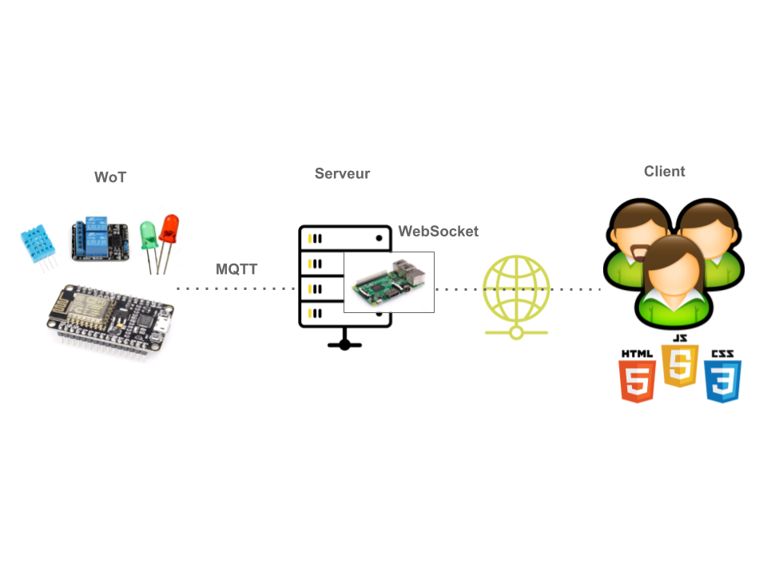
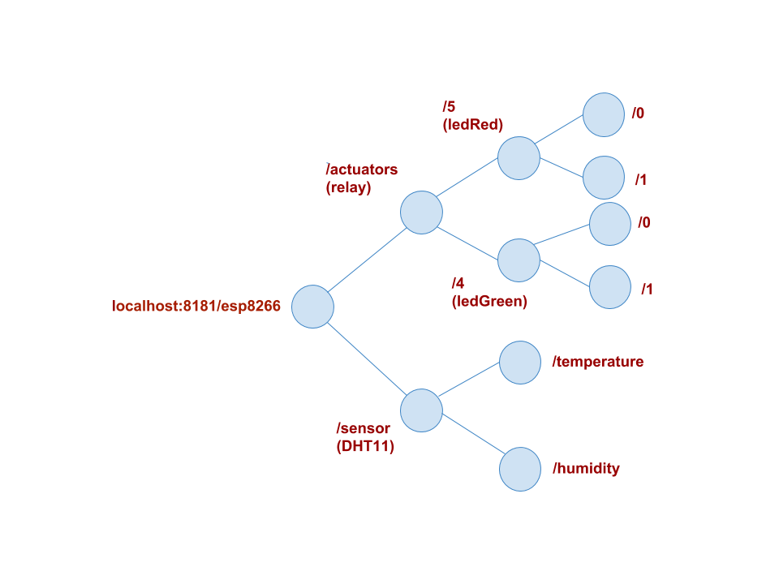

# OBJECTIF
On se propose de mettre en place un réseau web IoT composé d’objets à base de Raspberry Pi et ESP8266 (ESP32).
## Files:
### Rapport:
- [Rapport](Reseau_d’integration_Web_IoT.pdf)
### Client:
- [HTML: bootstrap, javascript](Client/index.html)
### Server:
- [Python:MQTT, Socketio, Flask](Server/server.py)
## Le schéma du réseau :

## La structure URI:

